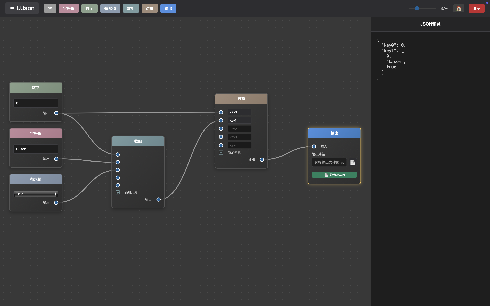

# UJson

基于节点操作的Json编辑器。

### 提醒

这是一个纯AI生成的项目， **除了这篇文档** 。

目前该工具还在早期阶段，很多功能尚不完善。由于我也不会多少前端技术栈，所以其中可能有一些Bug或痛点，也许需要您的一些帮助与反馈进行完善。

### 为什么想到做这个工具

我身边曾出现过许多朋友在工作中不得不接触到JSON这种数据格式，可他们自身又并不一定拥有相关技术背景，虽然这个数据格式的语法很简单，可当他们上手去修改时，经常因为语法问题给配置文件改错，最终酿成软件崩溃。

(然而许多技术出身的人也经常改错 =_=!!! )

多年来一直想要做这样一个工具，图形化生成JSON，可这样的想法多少有点 **「为了一碟醋包了盘饺子」** 的味道，直到AI编程的时代到来。

### 构建

首先你要安装好Rust工具链。

- Window
打开命令行，到时仓库根目录下，输入 `cargo tauri dev` 。

- MacOS
打开命令行，到仓库目录下的 `src-tauri` 目录下，输入 `cargo run` 。

### TODO

1. 复制选中的节点，并分配新的UUID
1. 选中多个节点时，一起拖动后，解决掉触发选择单个节点的事件
1. 导入 `.ujson` 格式文件时自动创建新的节点，并复原场景
1. 导入 `.json` 格式文件时自动跟据内容创建一组节点，并自动排序
1. 节点对齐功能